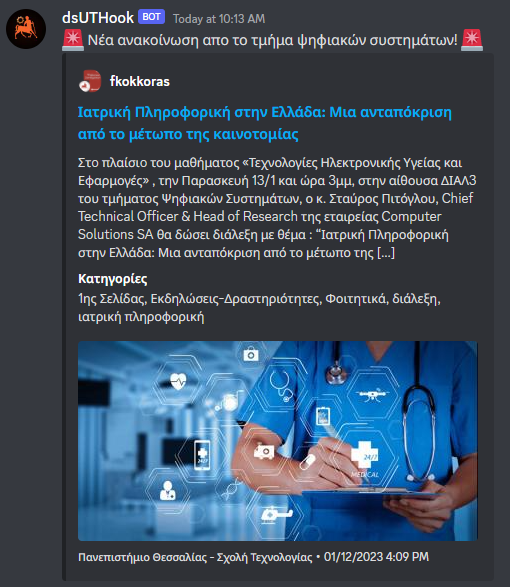

<div align="center">
    
    <h1>dsUTHook</h1>
    <p>Ένα απλό εργαλείο που στέλνει τα νέα του <a href="https://ds.uth.gr/">ΤΨΣ (ΠΘ)</a> σε Discord Webhooks.</p>
</div>

## Σχετικά
Το πρόγραμμα έχει γραφτεί για να εξυπηρετήσει τους τωρινούς και μελλοντικούς φοιτητές του [Τμήματος Ψηφιακών Συστημάτων (Πανεπιστημίου Θεσσαλίας)](https://ds.uth.gr/), η σελίδα της σχολής είναι μακριά από επιθυμητή, η σελίδα ανακοινώσεων είναι αργή, δυσανάγνωστη και δεν υποστηρίζει αυτόματες ενημερώσεις. Το Discord είναι είδη γνωστό στους περισσότερους φοιτητές και είναι συνήθως πάντα ανοιχτό στο παρασκήνιο του υπολογιστή. 

## Εγκατάσταση και εκτέλεση
```sh
# Κατεβάζουμε το GitHub repository με το git
git clone https://github.com/GekasD/dsUTHook.git

# Μπαίνουμε στο φάκελο του repository
cd dsUTHook

# Κατεβάζουμε εγκαθιστούμε τις απαραίτητες βιβλιοθήκες 
npm i

# Ρυθμίζουμε το config.json (Διαβάστε παρακάτω)

# Τρέχουμέ το πρόγραμμα
node .
```

## Χρήση και ρύθμιση (config.json)
```json
{
    "webhook_url": "",
    "cron_string": "*/30 * * * *",
    "initial": false,
    "message": "@everyone 🚨 Νέα ανακοίνωση απο το τμήμα ψηφιακών συστημάτων! 🚨",
    "footer": "Παρέχεται με ❤️ απο τον Γκέκα Δημήτριο"
}
```
Απ' ότι βλέπουμε υπάρχουν αρκετές ρυθμίσεις αλλά μην φοβάστε, είναι όλες προαιρετικές εκτός απο το: **webhook_url**.  
Απο μόνο του το πρόγραμμα είναι ρυθμισμένο να ελέγχει την σελίδα ανακοινώσεων κάθε 30 λεπτά για να αποφεύγουμε να "σπαμάρουμε" τους servers του Πανεπιστημίου, αυτό σημάινει ότι το αργότερο που θα πάρει να στήλει το webhook όταν βγαίνει ανακοίνωση είναι 30 λεπτά, στην πράξη αυτό είναι πολύ απίθανο, ο χρόνος ρυθμίζεται με [cron syntax](https://crontab.guru/). Ο host είναι υπεύθυνος να φτιάξει webhook στον Discord server του και να αντιγράφει το url και να το βάλει στο config.json σαν: `webhook_url`

### initial (config.json)
Η επιλογή initial αν είναι `true` θα στέλνει την τελευταία ανακόινωση όταν ξεκινάει το πρόγραμμα, χρήσιμη για δοκιμές κατα την διάρκεια του development, στις υπόλοιπες περιπτώσεις να παραμένει `false`

## Συμμετοχή
Αν θέλετε μπορείτε να κάνετε pull requests, θα τα αναλύω στον ελεύθερο μου χρόνο.

## Παράδειγμα εμφάνισης

